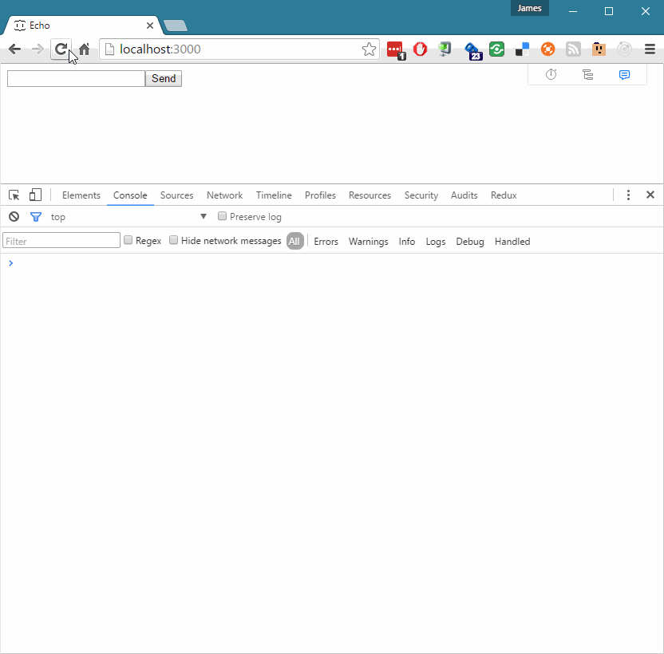

# SignalR React MobX Example

A simple Echo app demonstrating:
* SignalR
* Asp.NET WebApi
* MobX
* React
* TypeScript with Typings and TSX
* WebPack

## Server 
* Open /server/Server.sln in Visual Studio 2015
* F5 to run

## Client
* Install node.js
* `npm install`
* `npm start`

